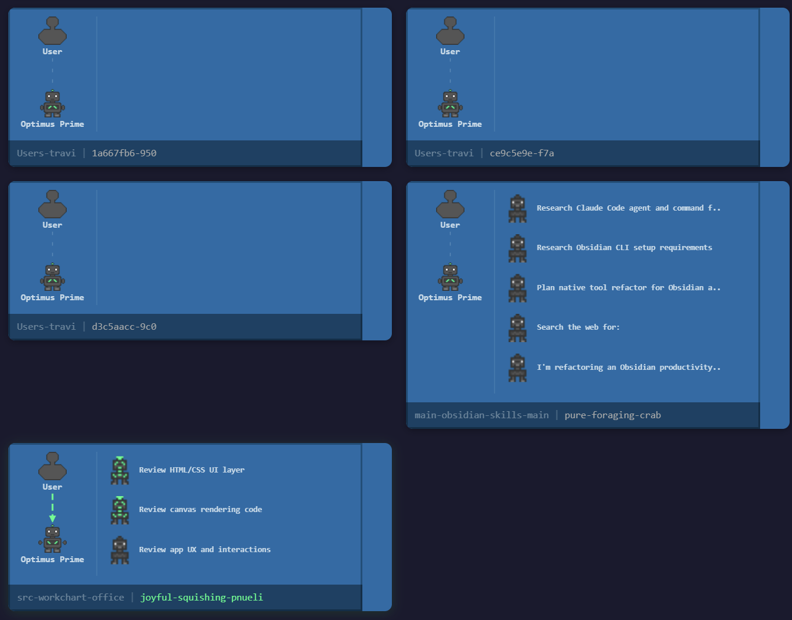

# WorkChart Office

Real-time visual monitor for Claude Code agent sessions. Each active session appears as a pixel-art "work box" showing the human orchestrator, the main agent, and any sub-agents that spin up during execution.

## Quick Start

Requires Python 3.10+ or Node.js v18+. No packages to install — zero external dependencies.

```bash
cd workchart_office
python serve.py            # Python (recommended)
# or
node serve.js              # Node.js (alternative)
```

Open **http://localhost:3200** in your browser. The server scans all projects under `~/.claude/projects/` and starts displaying active sessions. Use the project filter dropdown to focus on a specific project.

Works on **Windows**, **macOS**, and **Linux**.

### Options

```bash
python serve.py --port 8080    # Use a different port
PORT=8080 python serve.py      # Or via environment variable
```

### Configuration File

If your Claude Code projects directory is not at the default `~/.claude/projects/` location, create a `workchart.config.json` file in the same directory as the server scripts:

```json
{
  "projectsPath": "/custom/path/to/.claude/projects",
  "port": 3200
}
```

All fields are optional. Tilde (`~`) expansion is supported in `projectsPath`. CLI arguments and environment variables take precedence over config file values.

## What You See



Each session box is split into two columns:

| Element | Position | Description |
|---------|----------|-------------|
| Human (orchestrator) | Left column, top | Animates when you send a prompt |
| Connection line | Left column, middle | Animated dashed line linking human to agent |
| Main Agent (robot) | Left column, bottom | Animates when the agent uses tools |
| Sub-agents (brains) | Right column, vertical list | Appear dynamically when `Task`/`Agent` tools are invoked |
| Status bar | Bottom, full width | Project label, session name, state indicator |

### Agent States

- **Active** — Sprite animates, status shows current tool name
- **Idle** — Sprite static, status shows "Idle"
- **Waiting** — Speech bubble with "?" appears on the robot (agent asked a question)

## No Sessions State

When the server is running but no active Claude Code sessions are found, a "No sessions found" notification is displayed. Sessions appear automatically as Claude Code activity is detected.

## Session Reports

Click any **Human** sprite to open the detail panel, then click **View Report** to open a full session report in a new tab. The report includes:

- **Human vs AI Comparison** (top of page) — AI-powered estimate of how long a human would take the same task, with reasoning about workflow differences and a step-by-step breakdown. Falls back to a static per-tool estimate if the `claude` CLI is unavailable.
- **Executive Summary** — AI-generated overview of what was accomplished, key decisions, and outcomes
- **Timeline** — Chronological feed of all events, color-coded by type, click to expand
- **Session Info** (sidebar) — Name, project, duration, branch, tool counts
- **Agent Catalog** (sidebar) — Main agent and all sub-agents with tool breakdowns

Both AI features (comparison estimate and executive summary) require the `claude` CLI on PATH and are requested in parallel. Results are cached in `sessionStorage` to avoid re-generating on page refresh. Use **Save Report** to export a self-contained HTML snapshot.

### Fixing "claude CLI not found on PATH"

The executive summary and AI-powered time estimate both require that the `claude` command is on the PATH of the terminal running the server. If Claude Code is installed but the server can't find it, add the directory containing the `claude` binary to your PATH.

**macOS / Linux**

```bash
# Find where claude lives
which claude              # if it works from another terminal
find / -name claude 2>/dev/null   # or search for it

# Add its directory to your shell profile (zsh example):
echo 'export PATH="/path/to/directory:$PATH"' >> ~/.zshrc
source ~/.zshrc
```

**Windows**

1. Find the folder containing `claude.exe` (check the terminal where Claude Code works)
2. Open Start > search **"Environment Variables"** > Edit environment variables
3. Under **User variables**, select **Path** > Edit > New
4. Paste the folder path containing `claude.exe`
5. Click OK on all dialogs

After updating PATH, restart your terminal and the WorkChart Office server.

## Running Tests

Visit http://localhost:3200/test.html while the server is running:

1. Click **Run All Tests**
2. Results appear inline — green for pass, red for fail

The test harness covers the transcript parser, session state management, sprite engine, and box renderer (90 tests total).

## Project Structure

```
workchart_office/
├── serve.py                # Python server (recommended)
├── serve.js                # Node.js server (alternative)
├── index.html              # App entry point
├── report.html             # Session report page (standalone)
├── test.html               # Browser-based test harness (90 tests)
├── css/
│   ├── styles.css          # Dark theme, responsive grid
│   └── report.css          # Report page styles
├── js/
│   ├── app.js              # Main init, render loop, session lifecycle
│   ├── boxRenderer.js      # Canvas rendering for each session box
│   ├── detailPanel.js      # Detail panel for inspecting session elements
│   ├── fileReader.js       # HTTP API client for reading JSONL files
│   ├── report.js           # Session report: data processing and rendering
│   ├── sessionManager.js   # Session state tracking and polling
│   ├── spriteEngine.js     # Pixel-art sprites and animation
│   └── transcriptParser.js # JSONL record parsing
└── design/
    ├── docs/               # Design documentation
    │   ├── PRD.md
    │   ├── ARCHITECTURE.md
    │   ├── TECHNICAL_SPEC.md
    │   ├── DATA_DICTIONARY.md
    │   ├── VISUAL_DESIGN_SPEC.md
    │   ├── IMPLEMENTATION_ROADMAP.md
    │   ├── TEST_PLAN.md
    │   └── BROWSER_MCP_INTEGRATION.md
    ├── wireframes/
    │   └── box-layout.md
    └── reference/
        └── example_oveview.png
```

## How It Works

1. `serve.py` starts an HTTP server that serves the frontend and provides a JSON API
2. The API reads Claude Code JSONL transcript files from `~/.claude/projects/<project-dir>/`
3. Each `.jsonl` file = one session = one box on screen
4. The browser polls the API every 2 seconds for new lines (read incrementally from last offset)
5. JSONL records are parsed into state events (tool use, sub-agent spawn, turn complete, etc.)
6. Canvas renders are driven by `requestAnimationFrame`, only re-drawing boxes with state changes

## Server API

| Endpoint | Description |
|----------|-------------|
| `GET /api/projects` | List all discovered project directories |
| `GET /api/sessions?project=<name>` | List `.jsonl` files (all projects if `project` omitted) |
| `GET /api/read?project=<name>&file=<name>&offset=<n>` | Read new lines from byte offset |
| `GET /api/subagents?project=<name>&session=<id>` | List sub-agent files for a session |
| `GET /api/session-transcript?project=<name>&session=<id>` | Full transcript + sub-agent data for reports |
| `POST /api/generate-summary` | AI-generated executive summary via `claude` CLI |
| `POST /api/estimate-human-time` | AI-powered human time estimate via `claude` CLI |
| `GET /*` | Serve static files |

## Requirements

- Python 3.10+ or Node.js v18+ (no packages needed for either)
- Any modern browser (Chrome, Edge, Firefox, Safari)
- Works on Windows, macOS, and Linux
